# Speculators 框架拆解与技术参考

> 本文档面向「设计昇腾投机推理框架」的场景，从框架设计角度拆解 [Speculators](https://github.com/vllm-project/speculators) 的核心能力与组件边界。  
> 语言尽量口语化，重点是**能拿来对照设计**，而不是复述 API 文档。

---

## 1. 先搞清楚：Speculators 到底管什么、不管什么

一句话：**Speculators 管的是「怎么训练 draft 模型 + 怎么把 checkpoint 标准化」，不管在线推理时 draft/verify 循环本身。**

投机推理的完整链路长这样：

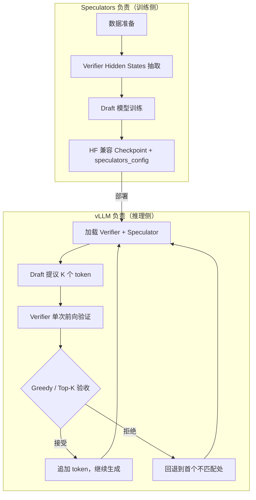

这个边界对设计昇腾框架很关键：

| 能力 | Speculators 有 | 推理引擎（vLLM / 你的昇腾框架）要有 |
|------|----------------|-------------------------------------|
| Draft 模型结构定义 | ✅ | ✅ 加载 + 执行 forward |
| Verifier 前向 + KV Cache | ❌（训练时借 vLLM 抽 hidden） | ✅ |
| Draft → Verify → Accept 循环 | ❌（只写配置） | ✅ |
| Hidden States 离线/在线生成 | ✅ | 可选复用 |
| 分布式训练（FSDP） | ✅ | 一般不需要 |
| 标准化 config.json | ✅ | 读 config 驱动行为 |

所以如果你要做「昇腾投机推理框架」，Speculators 最值得参考的是：**算法插件化、配置分层、训练数据契约、draft 模型抽象**；而 **verify 循环、调度、KV 复用、NPU kernel 适配** 需要你在推理侧自己设计。

---

## 2. 整体分层：五层架构

从框架设计视角，可以把 Speculators 拆成五层：

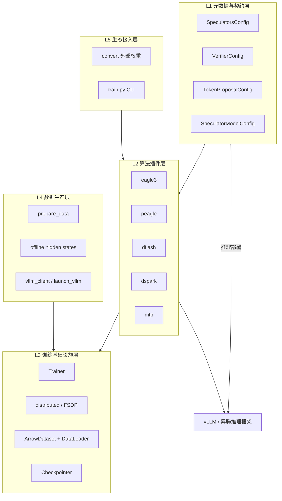

### 各层职责（口语版）

**L1 元数据层** — 把「这是什么算法、怎么提议 token、verifier 是谁」写进 `config.json`，推理引擎读这个就能跑，不用硬编码算法分支。

**L2 算法插件层** — 每种投机算法一个独立包（`models/eagle3`、`models/dflash`…），通过注册表挂进来，训练脚本不用改。

**L3 训练基础设施** — 通用的 Trainer、FSDP 分片、checkpoint、优化器调度，跟具体算法无关。

**L4 数据生产** — 训练 draft 需要 verifier 的中间 hidden states，这层负责离线批量生成或在线按需拉取。

**L5 生态接入** — 把 SafeAILab/EAGLE、z-lab/DFlash 等外部 checkpoint 转成标准格式。

---

## 3. 核心抽象：四个「接口级」组件

### 3.1 SpeculatorModel — Draft 模型的统一入口

路径：`src/speculators/model.py`

所有算法都继承 `SpeculatorModel`，它干几件事：

1. **注册表发现**：`@SpeculatorModel.register("dflash")`，训练时 `get_class("dflash")` 就能拿到类
2. **HF 兼容**：继承 `PreTrainedModel`，`from_pretrained` / `save_pretrained` 走标准流程
3. **训练契约**：子类必须实现
   - `layers`：decoder 层列表（FSDP 按层 wrap 就靠这个）
   - `from_training_args()`：从 CLI 参数构建模型
   - `get_trainer_kwargs()`：返回传给 `forward()` 的训练超参
   - `forward()` → `(output, loss, metrics)`

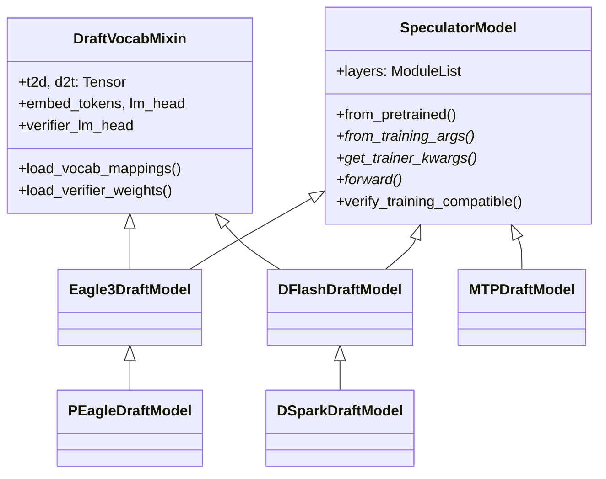

**设计要点**：`SpeculatorModel` 把「模型是谁」和「怎么训练」绑在一起（工厂方法模式），类似 transformers 的 `from_pretrained`，但多了训练侧的 `from_training_args`。你做昇腾框架时，推理侧只需要「加载 + forward」，训练侧可以单独设计，但**配置 schema 建议对齐**。

### 3.2 DraftVocabMixin — 词表压缩

路径：`src/speculators/model.py`

很多 draft 模型用**缩减词表**（比如 128K → 32K），靠 `t2d`（target→draft 布尔掩码）和 `d2t`（draft→target 映射）实现：

- `embed_tokens` / `lm_head`：从 verifier 拷贝，按 t2d 裁剪
- `verifier_lm_head`：冻结，训练时当 label 来源
- 训练前 `build_vocab_mapping.py` 从 token 频率统计生成映射

MTP 是例外——它直接用 verifier 全词表，不做缩减。

### 3.3 配置体系 — 三层 config 嵌套

路径：`src/speculators/config.py`

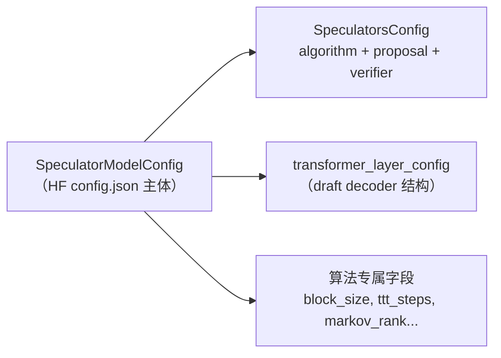

| 配置类 | 存什么 | 谁读 |
|--------|--------|------|
| `SpeculatorModelConfig` | draft 结构、词表大小、算法参数 | 训练 + 推理加载 |
| `SpeculatorsConfig` | `algorithm`、`proposal_methods`、`verifier` | **推理引擎重点读这个** |
| `VerifierConfig` | verifier 的 name_or_path、architectures | 兼容性校验 |
| `TokenProposalConfig` | greedy 的 speculative_tokens、accept_k 等 | 推理验收策略 |

`speculators_model_type` 是 discriminator 字段（`eagle3` / `dflash` / `dspark`…），决定实例化哪个模型类。

### 3.4 TokenProposalConfig — 推理验收策略（训练不管）

路径：`src/speculators/proposals/greedy.py`

训练只产出 draft logits；**推理时**怎么验收是 `GreedyTokenProposalConfig` 的事：

- `speculative_tokens`：每轮最多提议几个 token
- `verifier_accept_k`：verifier top-k 内就算接受
- `accept_tolerance`：log-likelihood 容差

DFlash 会把 `speculative_tokens` 设成 `block_size - 1`（锚点位置本身不输出 draft token）。

---

## 4. 支持的算法：一张表看清差异

| 算法 | 注册名 | Draft 生成方式 | 条件输入 | 继承关系 | 推理部署 |
|------|--------|---------------|----------|----------|----------|
| EAGLE-3 | `eagle3` | 自回归，TTT 多步扩展 | 多层 aux hidden → FC → concat(embed) | 基类 | vLLM 成熟 |
| P-EAGLE | `peagle` | 单 pass 并行多深度 | COD 采样 + 特殊 mask | extends EAGLE3 | vLLM 支持 |
| DFlash | `dflash` | 锚点块内并行（非因果） | mask token + target hidden 注入 | 基类 | vLLM PR #38300 |
| DSpark | `dspark` | 同 DFlash + Markov bias | 同上 + 块内前一 token | extends DFlash | 训练完整，推理文档少 |
| MTP | `mtp` | K 步 teacher-forced | verifier last hidden + embed | 基类 | Qwen3-Next/3.5 等 |

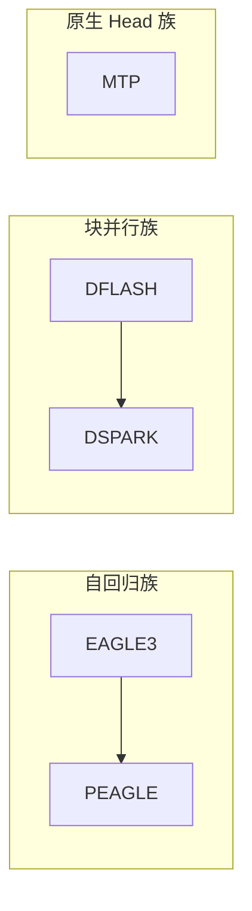

**框架设计启示**：三种 draft 范式（自回归 / 块并行 / 原生 MTP）差异很大，但共享同一套「配置 + 注册 + 训练数据契约」。你做昇腾框架时，推理调度器至少要能区分这三类 forward 模式。

---

## 5. 训练流水线：从数据到 checkpoint

### 5.1 端到端流程

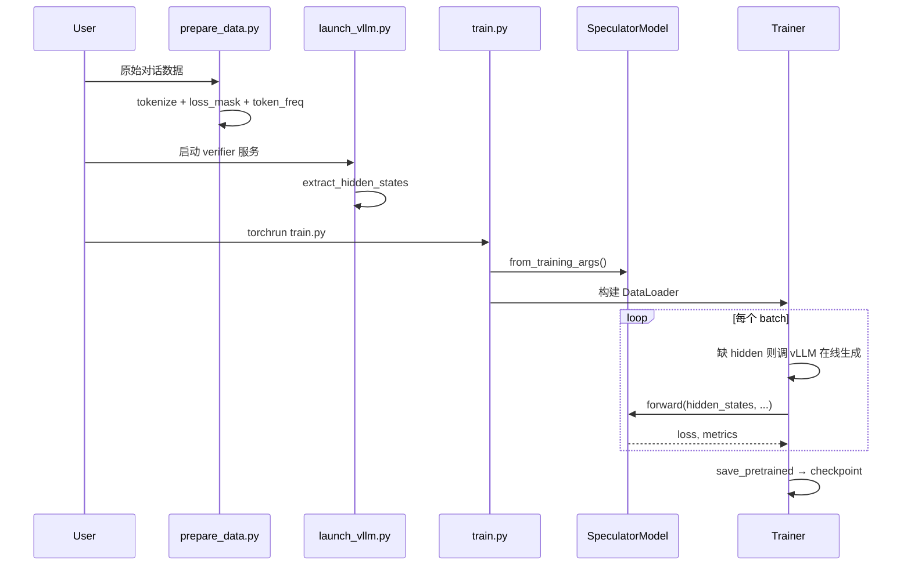

### 5.2 训练样本的数据契约

路径：`src/speculators/train/data.py`

每个样本核心是这些字段：

```python
{
    "hidden_states":        [seq_len, num_aux_layers * hidden_size],  # draft FC 输入
    "input_ids":            [seq_len],
    "verifier_last_hidden_states": [seq_len, hidden_size],            # 算 target logits
    "loss_mask":            [seq_len],                                   # 哪些位置参与 loss
    "document_ids":         [seq_len],                                   # 文档边界（attention mask）
    "position_ids":         [seq_len],
}
```

v1 格式里 `hidden_states` 是多层 list，标准化函数 `standardize_data_v1` 会：

- 前几层 concat 成 `hidden_states[:, :-1]`
- 最后一层单独作为 `verifier_last_hidden_states`

**昇腾适配点**：如果你的 verifier 跑在昇腾 vLLM 上，hidden state 抽取的**层 ID 对齐**、**dtype（bf16）**、**plane 数量（N aux + 1 verifier）** 必须和训练侧 `target_layer_ids` 一致，否则 FC 维度对不上。

### 5.3 训练基础设施组件

| 组件 | 路径 | 干什么 |
|------|------|--------|
| Trainer | `train/trainer.py` | epoch 循环、optimizer/scheduler、metrics 聚合 |
| distributed | `train/distributed.py` | DP/SP 进程组 + per-layer FSDP |
| ArrowDataset | `train/data.py` | 读 arrow/safetensors，缺数据时在线生成 |
| distributed_batch_sampler | `train/distributed_batch_sampler.py` | LPT multipack 序列打包 |
| checkpointer | `train/checkpointer.py` | 分布式 checkpoint + 中途 resume |
| vocab_mapping | `train/vocab_mapping.py` | t2d/d2t 构建 |

FSDP 策略很直接：对每个 `model.layers[i]` 做 `fully_shard`，最后对整个 model 再 `fully_shard`，混合精度 bf16 参数 + fp32 reduce。

---

## 6. 推理侧：Speculators 只「描述」，不「执行」

推理时 vLLM 读 checkpoint 里的 `speculators_config`，大致逻辑：

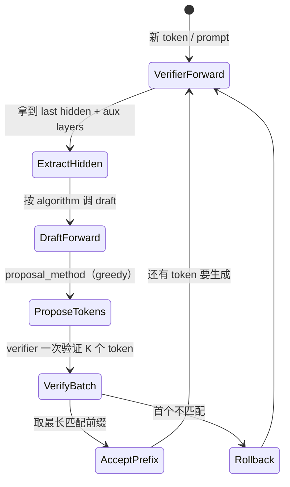

你要设计的昇腾框架，**这块是主战场**——Speculators 只提供了 `GreedyTokenProposalConfig` 的 schema 和 draft 模型权重。

---

## 7. DFlash 深度拆解

### 7.1 核心思想（跟 EAGLE3 的本质区别）

EAGLE3 是**自回归**：draft 一个一个 token 往后猜，attention mask 随 TTT 步数扩展。

DFlash 是**块并行**：从序列里选若干**锚点（anchor）**，每个锚点一次性预测 `block_size` 个 token（块内双向 attention），推理时 verifier 批量验证整块。

### 7.2 模块组成

```
models/dflash/
├── config.py          # block_size, max_anchors, aux_hidden_state_layer_ids, mask_token_id
├── core.py            # DFlashDraftModel：主 forward + _backbone_forward
├── attention.py       # 锚点块 flex attention mask
├── utils.py           # select_anchors, get_base_indices_for_anchored_blocks
├── model_definitions.py  # Qwen3DFlashDecoderLayer（target_hidden 注入）
└── metrics.py         # 块内位置衰减 loss（gamma）
```

### 7.3 Forward 数据流

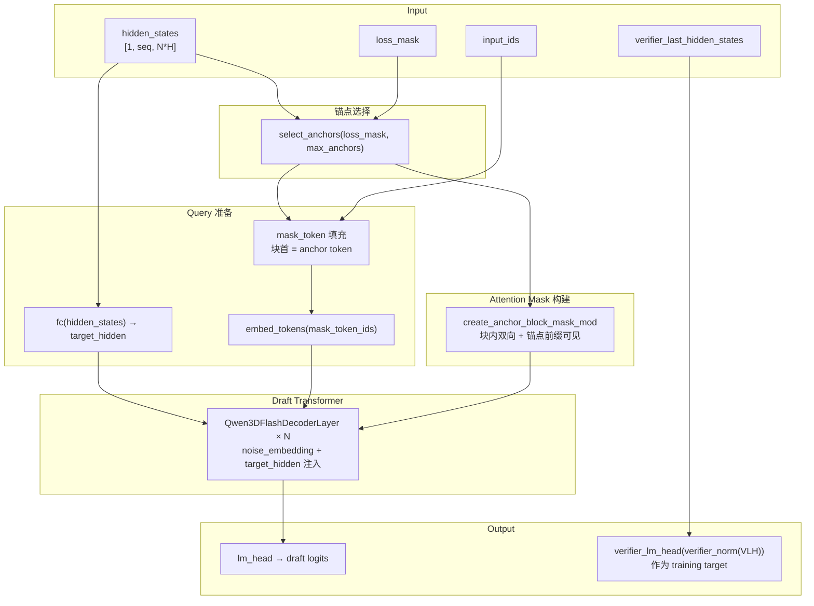

### 7.4 Attention Mask 语义（推理也必须复现）

路径：`models/dflash/attention.py`

Query 侧：`n_anchors × block_size` 个合成 token。  
KV 侧：`[原始序列 | 合成块]`。

每个 query 块 j 的规则：

- 能看**同文档、锚点之前**的 base token
- 能看**自己块内**所有 token（双向）
- **不能**看其他块或其他文档

可选 sliding window：按 layer index 切换 full / sliding attention（`--sliding-window` 系列参数）。

### 7.5 训练特有参数

| CLI 参数 | 含义 |
|----------|------|
| `--block-size` | 每锚点块大小（默认 8） |
| `--max-anchors` | 训练时最多采样几个锚点 |
| `--target-layer-ids` | 哪些 verifier 层的 hidden 喂给 FC |
| `--mask-token-id` | 块内占位符 token |
| `--draft-attn-impl` | `simple_flex_attention` / `sdpa` / `eager` |
| `--dflash-decay-gamma` | 块内位置 loss 衰减系数 |
| `--sliding-window*` | 滑动窗口 attention 相关 |

### 7.6 引入 DFlash 时的改动清单（框架视角）

如果你要从零支持 DFlash，需要动这些点：

| 改动域 | 具体内容 |
|--------|----------|
| **配置** | 新增 `DFlashSpeculatorConfig`；`speculators_model_type=dflash` |
| **模型** | `Qwen3DFlashDecoderLayer`（target_hidden 残差注入）；非因果 attention |
| **注册** | `@SpeculatorModel.register("dflash")` |
| **训练 CLI** | `train.py` 加 block_size / max_anchors / target_layer_ids 等 |
| **Loss** | `dflash_loss_decay`：锚点位置 weight=0，块内按 gamma^pos 衰减 |
| **数据** | hidden_states 层数 = len(target_layer_ids)；verifier plane 单独一路 |
| **推理配置** | `GreedyTokenProposalConfig(speculative_tokens=block_size-1)` |
| **转换** | `convert/dflash/converter.py` 支持 z-lab 外部权重 |
| **vLLM 对接** | hidden state 抽取 + draft forward + 块验证逻辑 |

---

## 8. DSpark 深度拆解：在 DFlash 上加了什么

### 8.1 定位

DSpark = **DFlash backbone** + **Markov 序列头** + **Confidence 接受率预测头**。

解决什么问题？纯 DFlash 块内是并行的，块内 token 之间没有显式序列依赖；DSpark 用低秩 Markov bias 补上「前一个 token 对当前位置 logit 的影响」，confidence head 则预测每个位置被 verifier 接受的概率，方便推理时做更聪明的 draft 策略（比如动态截断）。

### 8.2 继承关系与代码复用

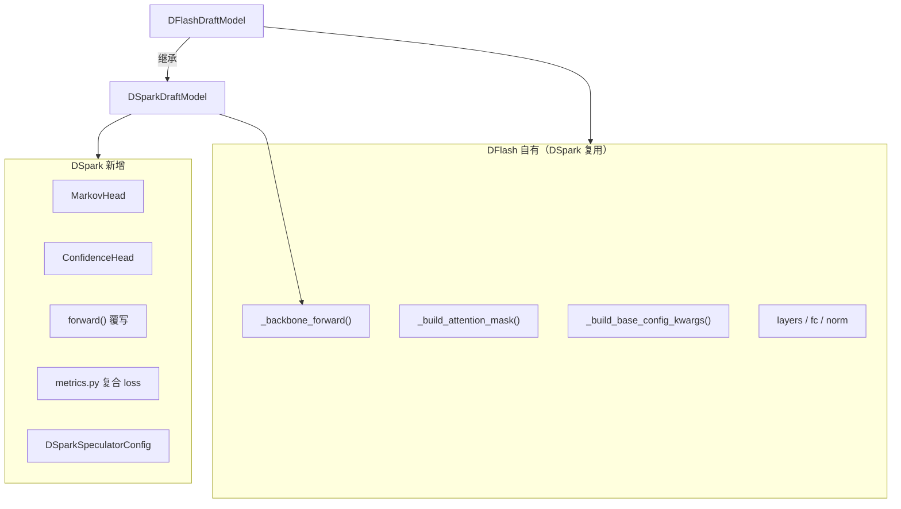

DSpark **没有重写** `_backbone_forward`，只在 backbone 输出 logits 之后加 Markov bias 和 confidence 预测。

### 8.3 MarkovHead 机制

路径：`models/dspark/model_definitions.py`

低秩分解：`B = W1(prev_token) @ W2 → draft_vocab` 维 bias，加到 DFlash logits 上。

三种变体：

| 类型 | 行为 |
|------|------|
| `vanilla` | 一阶 Markov：`markov_w2(W1(prev_token))` |
| `gated` | hidden 和 prev_emb concat 后过 gate，再乘 prev_emb |
| `rnn` | 块内逐步更新 recurrent state |

### 8.4 ConfidenceHead 与 Loss

路径：`models/dspark/metrics.py`

```
loss = compound_loss(CE/TV/KL...) + confidence_head_alpha * BCE(confidence, accept_rate)
```

`accept_rate` 的解析目标：`sum_v min(p_draft, p_verifier) = 1 - d_TV`，即 draft 和 verifier 分布的重叠度，也就是「这个位置被接受的理论概率」。

### 8.5 DSpark 相对 DFlash 的增量改动表

| 层级 | DFlash 已有 | DSpark 新增/修改 |
|------|-------------|----------------|
| Config | `DFlashSpeculatorConfig` | + `markov_rank`, `markov_head_type`, `enable_confidence_head`, `confidence_head_with_markov` |
| Model `__init__` | backbone | + 条件创建 `MarkovHead`, `ConfidenceHead` |
| `from_training_args` | `_build_base_config_kwargs("dflash", ...)` | 同上但 algorithm=`dspark`，追加 Markov/conf 参数 |
| `forward` | backbone → loss | backbone → Markov bias → confidence → 复合 loss |
| `get_trainer_kwargs` | loss_config, gamma | + `confidence_head_alpha` |
| Metrics | `dflash/metrics.py` | 独立 `dspark/metrics.py`，含校准指标 |
| CLI | dflash 参数 | + `--markov-rank`, `--markov-head-type`, `--enable-confidence-head`, `--confidence-head-with-markov`, `--confidence-head-alpha`, `--loss-fn` JSON |
| 测试 | dflash attention/utils | + `test_dspark_model_definitions.py`, `test_dspark_metrics.py` |
| 文档 | `docs/.../dflash.md` | **暂无独立文档**（主要靠代码 + `examples/train/dspark.sh`） |
| 推理 | vLLM dflash | **需确认** vLLM 对 `algorithm=dspark` 的支持状态 |

### 8.6 昇腾训练实例：dspark.sh 的关键对齐点

路径：`examples/train/dspark.sh`（GLM5.2 / Ascend NPU 场景）

这个脚本暴露了 DSpark 在昇腾上落地时最容易踩坑的几个对齐点：

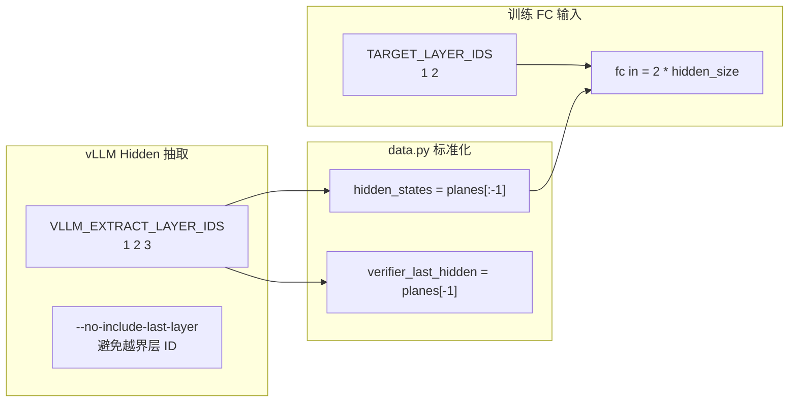

**Plan A 策略**（verifier 只有 4 层时）：

- vLLM 抽 3 个 plane：`[L1, L2, L3]`
- 训练 FC 用 `L1, L2`（2 层 aux）
- `L3` 作为 `verifier_last_hidden_states` 的 proxy
- `--no-include-last-layer` 防止 launch_vllm 追加无效的 `num_hidden_layers` 索引

**昇腾环境变量**（脚本里已有）：

- `ASCEND_RT_VISIBLE_DEVICES` 分离 vLLM GPU 和训练 GPU
- `DRAFT_ATTN_IMPL=sdpa`（昇腾上 flex attention 可能不可用，退到 sdpa/eager）
- HCCL / NPU 内存相关 export

---

## 9. 算法插件机制：怎么加一个新算法

官方指南：`docs/developer/add_algorithm.md`

核心模式就四步：

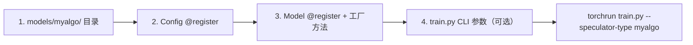

注册表实现：`src/speculators/utils/registry.py`

- `ClassRegistryMixin`：模型类注册
- `PydanticClassRegistryMixin`：配置类注册
- `auto_package = "speculators.models"`：import 时自动发现

**设计启示**：训练入口 `train.py` 不需要 if-else 算法分支，全靠 registry。你做昇腾框架时，推理侧也建议用同样模式——`algorithm` 字段驱动 factory，而不是到处 switch-case。

---

## 10. 对照设计：昇腾投机推理框架的建议模块划分

结合 Speculators 的拆解，如果要做面向昇腾的投机推理框架，可以这么划：

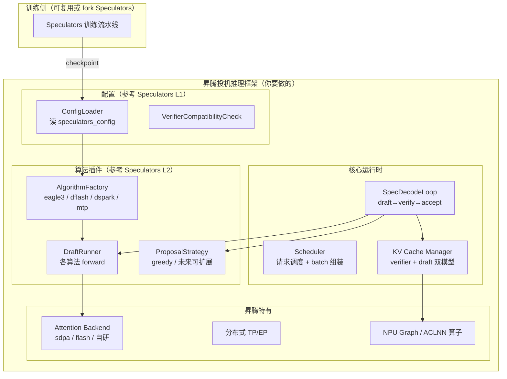

### 10.1 各模块跟 Speculators 的映射

| 你的模块 | 参考 Speculators | 昇腾特别注意 |
|----------|------------------|--------------|
| ConfigLoader | `config.py` + `SpeculatorsConfig` | JSON schema 兼容，方便直接用 RH 发布的 checkpoint |
| AlgorithmFactory | `SpeculatorModel.registry` | dspark 推理支持需自行实现或等 vLLM 上游 |
| DraftRunner | 各 `models/*/core.py` 的 forward | DFlash 非因果 mask 在 NPU 上的实现；`draft-attn-impl=sdpa` |
| ProposalStrategy | `proposals/greedy.py` | DSpark confidence 可用于动态截断 draft 长度 |
| SpecDecodeLoop | vLLM 内部逻辑 | 这块 Speculators 没有，需自研 |
| HiddenStateExtractor | `launch_vllm.py` + `data_generation/` | 层 ID 对齐、plane 切分、bf16 |
| 训练 | 整套 `train/` + `scripts/` | FSDP 可换 MindSpeed/FSDPTurbo；在线训练需昇腾 vLLM |

### 10.2 DFlash/DSpark 在推理侧的额外工作

相比 EAGLE3，块并行算法在推理侧多这些活：

1. **锚点选择策略**：训练时随机采样；推理时要决定「从哪个位置起块」
2. **块内并行 forward**：一次出 `block_size` 个 token，KV 布局不同于自回归
3. **批量验证**：verifier 一次前向验整块，accept 最长前缀
4. **DSpark 特有**：Markov bias 需要块内 rolling prev_token；confidence 可用于提前终止块内 draft
5. **mask_token_id**：推理时块内占位符的处理

---

## 11. 文件索引（快速定位）

### 核心抽象

| 文件 | 内容 |
|------|------|
| `src/speculators/model.py` | SpeculatorModel, DraftVocabMixin |
| `src/speculators/config.py` | 三层配置体系 |
| `src/speculators/utils/registry.py` | 注册表 |
| `src/speculators/proposals/greedy.py` | 推理验收配置 |

### 算法实现

| 文件 | 内容 |
|------|------|
| `src/speculators/models/eagle3/core.py` | EAGLE3 自回归 draft |
| `src/speculators/models/peagle/core.py` | P-EAGLE 并行 COD |
| `src/speculators/models/dflash/core.py` | DFlash 块并行 backbone |
| `src/speculators/models/dflash/attention.py` | 锚点块 mask |
| `src/speculators/models/dspark/core.py` | DSpark = DFlash + Markov + Confidence |
| `src/speculators/models/dspark/model_definitions.py` | MarkovHead, ConfidenceHead |
| `src/speculators/models/mtp/core.py` | MTP head 微调 |

### 训练与数据

| 文件 | 内容 |
|------|------|
| `scripts/train.py` | 统一训练入口 |
| `scripts/prepare_data.py` | 数据预处理 |
| `scripts/launch_vllm.py` | vLLM hidden state 服务 |
| `examples/train/dspark.sh` | 昇腾 DSpark 在线训练示例 |
| `src/speculators/train/trainer.py` | Trainer |
| `src/speculators/train/distributed.py` | FSDP |
| `src/speculators/train/data.py` | 数据集 + 在线生成 |

### 转换与文档

| 文件 | 内容 |
|------|------|
| `src/speculators/convert/entrypoints.py` | 外部权重转换入口 |
| `src/speculators/convert/dflash/converter.py` | DFlash 转换 |
| `docs/developer/add_algorithm.md` | 扩展算法指南 |
| `docs/user_guide/algorithms/dflash.md` | DFlash 算法说明 |

---

## 12. 总结：拿 Speculators 设计昇腾框架的三句话

1. **训练归训练，推理归推理** — Speculators 的价值在标准化 draft 训练与 checkpoint；verify 循环是你推理框架的核心，别指望从这里 copy。

2. **算法用插件，配置用契约** — registry + `speculators_config` 这套设计值得原样借鉴，尤其 DFlash/DSpark 的块并行和 DSpark 的 confidence 头，推理侧要有对应的 execution path。

3. **DSpark 是 DFlash 的增量** — 如果昇腾框架先支持 DFlash 推理，加 DSpark 主要是 MarkovHead forward + confidence 驱动的 proposal 策略，backbone 和 attention mask 可以完全复用。

---

## 附录：投机推理核心概念速查

| 术语 | 含义 |
|------|------|
| Verifier | 大模型（目标模型），最终裁判 |
| Speculator / Draft | 小模型，负责快速提议 token |
| Aux Hidden States | verifier 中间层输出，作为 draft 条件 |
| t2d / d2t | 全词表 ↔ 缩减词表映射 |
| TTT Steps | EAGLE3 测试时训练步数，训练时模拟多步自回归 |
| Anchor | DFlash 块的起始位置 |
| Block Size | 每个锚点并行预测的 token 数 |
| Markov Rank | DSpark 低秩序列 bias 的秩 |
| Greedy Proposal | 每轮取 draft top-1，verifier 验证接受最长前缀 |

---

*文档生成基于 speculators 源码分析，适用于框架设计参考。算法细节以官方文档为准：*  
*https://docs.vllm.ai/projects/speculators/en/latest/*
